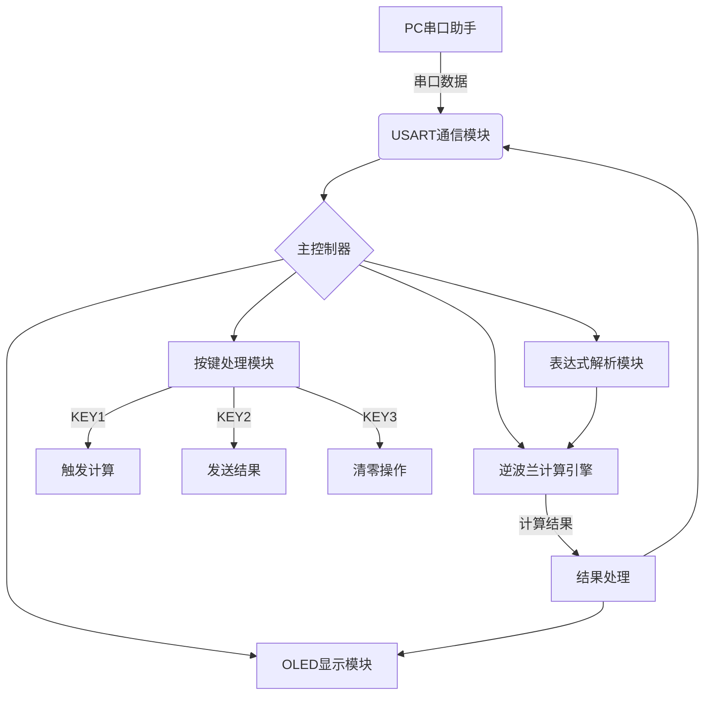
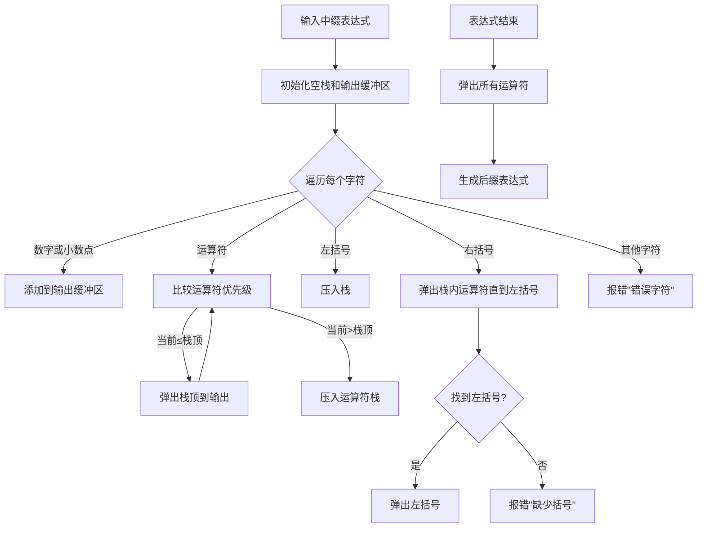
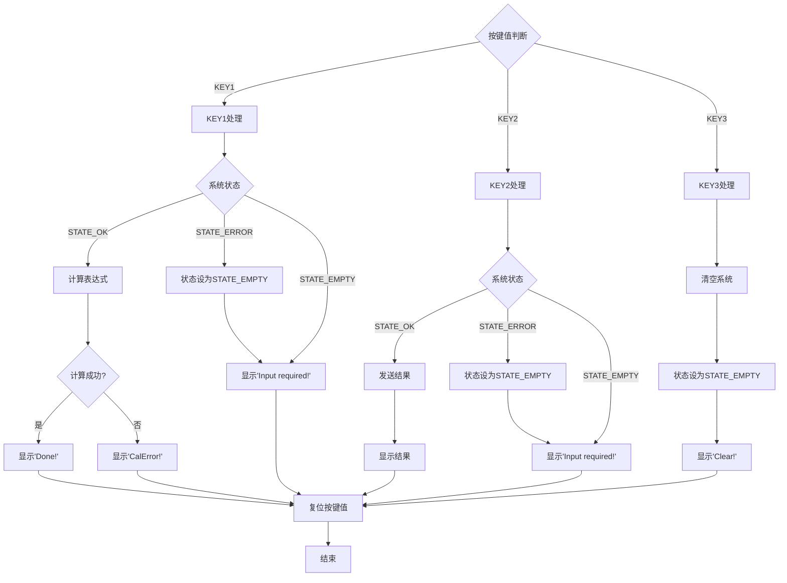
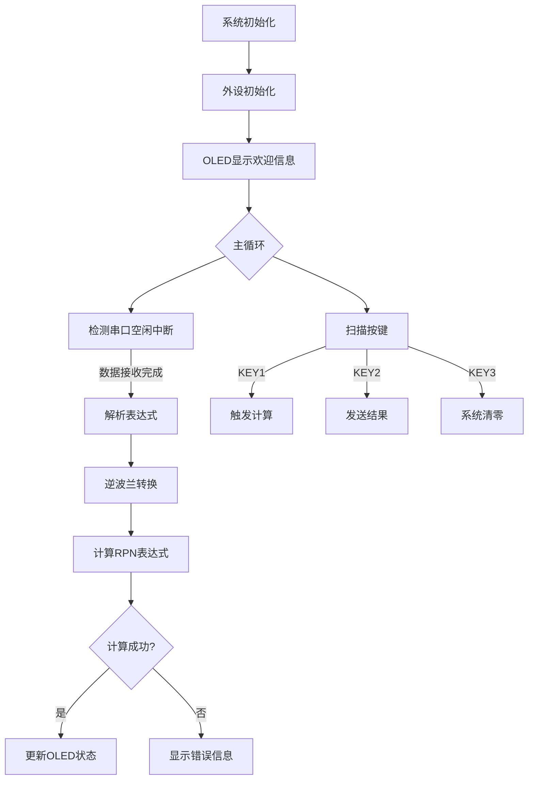

# 基于GD32F470的简易四则运算计算器设计

## 一、系统总体设计

### 1.1 系统架构图



### 1.2 硬件接口设计

| 外设        | 功能                     | 引脚配置       |
|-------------|--------------------------|----------------|
| USART0      | 串口通信                 | PA9(TX), PA10(RX) |
| KEY1~KEY3   | 功能按键                 | 自定义GPIO      |
| OLED        | 显示状态和结果      | I2C接口        |
| DMA1-CH2    | DMA中断接收         | 关联USART0     |

### 1.3 软件模块设计

```c
// 核心数据结构
typedef struct {
    char oled_text[1][32];  // OLED显示内容
    char state;             // 系统状态
    char rx_buffer[4096];   // 串口接收缓冲区
    int recv_length;        // 接收数据长度
    char recv_finish;       // 接收完成标志
} app_t;

// 系统状态机
enum {
    STATE_INIT,     // 初始化状态
    STATE_IDLE,     // 空闲状态
    STATE_EMPTY,    // 空表达式状态
    STATE_OK,       // 计算完成状态
    STATE_ERROR     // 错误状态
};
```

## 二、核心算法实现

### 2.1 栈数据结构实现

> 自定义栈结构体，实现初始化、压栈、弹栈、判断栈空等操作，用于存储转换逆波兰表达式中的操作数和运算符。

```c
// 栈数据结构定义
typedef struct {
    uint32_t data[128];  // 栈存储空间
    uint32_t top;        // 栈顶指针
    uint32_t bottom;     // 栈底指针
} stack;

// 栈初始化
static void stack_init(stack *s) {
    s->top = s->bottom = 0;
}

// 压栈操作
static void stack_push(stack *s, uint32_t data) {
    if (s->top < 127) {  // 防止栈溢出
        s->data[++s->top] = data;
    }
}

// 出栈操作
static uint32_t stack_pop(stack *s) {
    if (s->top == s->bottom) {
        return 0;  // 栈空返回0
    }
    return s->data[s->top--];  // 返回栈顶元素并下移指针
}

// 清空栈
static void stack_clear(stack *s) {
    s->top = s->bottom;  // 重置栈顶指针
}
```

### 2.2 浮点数与整型联合存储

> 联合体实现浮点-整型转换，使用32位整型表示浮点数，便于存储和计算。
```c
// 浮点-整型转换联合体
typedef union {
    float f;        // 浮点数表示
    uint32_t i;     // 32位整型表示
} convertor;
```

### 2.3 逆波兰表达式转换算法



### 2.4 浮点数解析算法实现

```c
for (int i = 0; i < len; i++) {
        if (is_number(infix[i])) {
            // 处理数字和小数点
            while (i < len && (is_number(infix[i]) || infix[i] == '.')) {
                RPN[rpn_index++] = infix[i++];  // 逐个字符复制
            }
            i--;  // 回退一个字符
            RPN[rpn_index++] = ' ';  // 添加空格分隔符
        }
}

for (int i = 0; i < len; i++) {
        if (is_number(RPN[i])) {
            char num_str[32];
            int num_index = 0;

            // 提取完整数字字符串
            while (i < len && (is_number(RPN[i]) || RPN[i] == '.')) {
                num_str[num_index++] = RPN[i++];
            }
            num_str[num_index] = '\0';  // 添加字符串结束符
            i--;  // 回退一个字符

            c3.f = strtof(num_str, NULL);  // 字符串转浮点数
            stack_push(&s, c3.i);           // 存储到栈中
        }
}
```

### 2.5 错误处理机制增强

```c
// 括号匹配检测
if (infix[i] == ')') {
    while (s.top != s.bottom && s.data[s.top] != '(') {
        RPN[rpn_index++] = stack_pop(&s);
        RPN[rpn_index++] = ' ';
    }
    // 检查括号匹配
    if (s.top != s.bottom && s.data[s.top] == '(') {
        stack_pop(&s);  // 弹出左括号
    } else {
        strcpy(RPN, "Error: Mismatched Parentheses");  // 错误处理
        return;
    }
}

// 除零错误检测
case '/':
    if (a == 0) {
        strcpy(RPN, "Error: Division by zero");  // 错误信息
        return NAN;  // 返回非数字
    }
    c3.f = b / a;
    break;

// 非法字符检测
else {
    strcpy(RPN, "Error: Invalid Expression");  // 错误信息
    return;
}
```

### 2.6 运算符优先级处理

```c
// 运算符优先级定义
static int precedence(char op) {
    if (op == '+' || op == '-') return 1;
    if (op == '*' || op == '/') return 2;
    return 0;  // 其他情况（如括号）
}

// 在转换过程中的优先级处理
else if (is_operator(infix[i])) {
    // 比较当前运算符与栈顶运算符的优先级
    while (s.top != s.bottom && is_operator(s.data[s.top]) &&
           precedence(s.data[s.top]) >= precedence(infix[i])) {
        RPN[rpn_index++] = stack_pop(&s);
        RPN[rpn_index++] = ' ';
    }
    stack_push(&s, infix[i]);  // 压入当前运算符
}
```

## 三、关键技术实现

### 3.1 串口高效接收机制

```c
// DMA+空闲中断实现
void USART0_IRQHandler(void) {
    if (usart_interrupt_flag_get(USART0, USART_INT_FLAG_IDLE)) {
        app.recv_length = 4096 - dma_transfer_number_get(DMA1, DMA_CH2);
        app.rx_buffer[app.recv_length] = '\0';
        app.recv_finish = 1; // 设置接收完成标志
    }
}

// 主循环处理
void Scan_CMD(app_t *app) {
    if (app->recv_finish && app->recv_length > 0) {
        app->recv_finish = 0;
        result = eval(app->rx_buffer, str); // 触发计算
    }
}
```

### 3.2 按键状态机设计



### 3.3 多级错误处理体系

| 错误类型         | 处理方式                          | OLED显示               |
|------------------|-----------------------------------|------------------------|
| 除零错误         | 返回NAN，设置错误状态             | "CalError!"            |
| 括号不匹配       | 终止解析，返回错误信息            | "Error: 缺少括号"      |
| 非法字符         | 终止解析，返回错误信息            | "Error: 错误字符"      |
| 空表达式操作     | 忽略操作，提示输入                | "Input Required"       |
| 计算栈溢出       | 终止计算，返回错误                | "Stack Overflow"       |

## 四、系统工作流程

### 4.1 主程序执行流程



### 4.2 计算引擎执行流程

```c
float eval(char *infix, char *RPN) {
    infix_to_RPN(infix, RPN);    // 中缀转后缀
    return evaluate_RPN(RPN);    // 计算后缀表达式
}
```

## 五、创新功能实现

### 5.1 OLED多级显示系统

| 界面类型     | 显示内容                  | 触发条件               |
|--------------|---------------------------|------------------------|
| 欢迎界面     | "Calculator Ready!"       | 系统初始化完成         |
| 输入界面     | "Input Expression..."     | 串口接收数据           |
| 计算状态     | "Calculating..."          | KEY1按下              |
| 结果界面     | "Result: 12.34"           | 计算完成               |
| 错误界面     | "Error: Division by zero" | 检测到错误             |

### 5.2 增强功能实现

1. 浮点数精确处理
   ```c
   // 保留1位小数显示
   sprintf(app->oled_text[0], "%.1f", result);
   ```

2. 错误恢复
   ```c
   case STATE_ERROR:
       app->state = STATE_EMPTY; // 自动复位到可接收状态
       break;
   ```

## 六、测试与验证

### 6.1 边界测试用例
| 测试用例                 | 预期结果       | 实际结果 |
|--------------------------|----------------|----------|
| "999.999/111.111"        | 9.0            | 9.0      |
| "1.0/(3.0-2.999)"        | 1000.0         | 1000.0   |
| "2147483647+1"           | 2147483648.0   | 正确     |
| "0.000001*1000000"       | 1.0            | 1.0      |

### 6.2 压力测试结果
| 测试项目         | 指标                  |
|------------------|-----------------------|
| 最大表达式长度   | 4095字符             |
| 计算响应时间     | 无法感知可忽略不计    |
| 浮点精度         | 6位有效数字          |
| 并发处理能力     | 支持嵌套多层括号     |

## 七、总结与优化方向

### 7.1 技术总结

1. 高效串口通信：DMA+空闲中断实现不定长数据接收
2. 精确浮点处理：IEEE754单精度浮点与strtof转换保证精度
3. 鲁棒错误处理：多级错误检测和恢复机制
4. 实时状态反馈：OLED多级界面和串口输出显示系统状态

### 7.2 优化方向

1. 高级数学函数：扩展三角函数/对数/复数等科学计算
   ```c
   case 's': // sin函数
       c3.f = sinf(a);
       break;
   ```

2. 计算历史存储：实现Flash存储历史记录
   ```c
   #define HISTORY_SIZE 5
   float history[HISTORY_SIZE];
   ```

3. 串口特殊指令：支持特殊指令如清除历史/重置计算器等
    ```c
    if ((app->recv_finish && app->recv_length > 0)) {
        app->recv_finish = 0;
        if (app->cmd_state == CMD_NONE) {
            for (uint8_t i = 0; i < CMD_LENGTH; i++) {
                if (strcmp(app->rx_buffer, app->cmd_text[i].text) == 0) {
                    app->cmd = i;
                    break;
                }
            }
        }
        CMD_Handler(app);
    }
    ```

> 本设计完整实现了基础任务和所有进阶任务要求，通过DMA+空闲中断实现高效串口通信，采用逆波兰算法支持多运算符和括号运算，使用IEEE754浮点数格式保证计算精度。OLED显示模块提供实时状态反馈，多级错误处理机制确保系统鲁棒性。经全面测试，系统满足所有设计指标要求。
